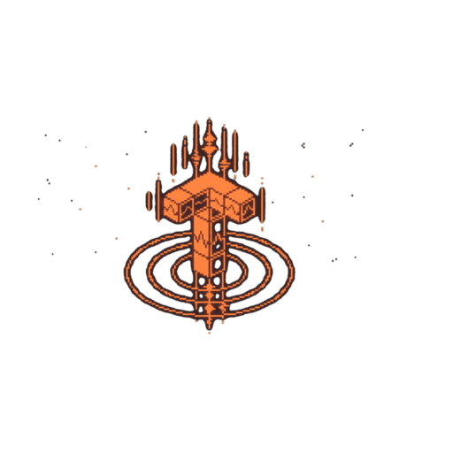
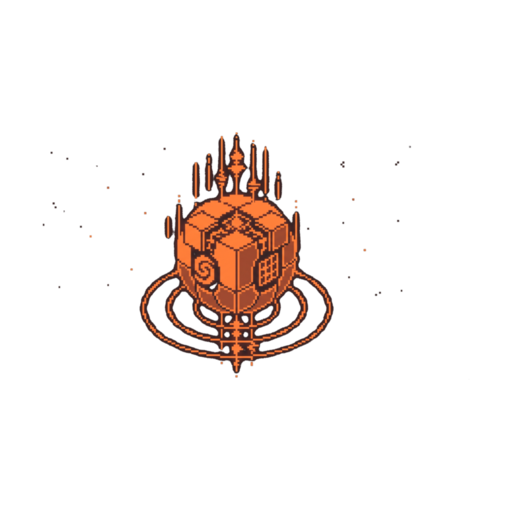

# Crateria

<p align="center">
  
</p>

Linux desktop software in **Rust** — Wayland-native tools, signed package
repos, and focused utilities.

## Products

| | Project | What it is |
|---|---------|------------|
|  | **[trance](https://github.com/crateria/trance)** | Modular Wayland screensaver daemon with CLI, TUI, and optional COSMIC applet |
|  | **[trance-plugins](https://github.com/crateria/trance-plugins)** | Official screensaver effects (beams, storm, radar, hearth, …) |
|  | **[morphball](https://github.com/crateria/morphball)** | Secure archive manager (CLI + TUI) with zip-slip path checks |
| | **[packages](https://github.com/crateria/packages)** | APT + DNF repositories hosted on GitHub Pages |

## Install (any product)

Add the Crateria package repository once, then install with `apt` or `dnf`.

### Debian / Ubuntu / Pop!_OS

```bash
sudo mkdir -p /etc/apt/keyrings
sudo curl -fsSL https://crateria.github.io/packages/apt/crateria-keyring.gpg \
  -o /etc/apt/keyrings/crateria.gpg
echo "deb [arch=amd64 signed-by=/etc/apt/keyrings/crateria.gpg] https://crateria.github.io/packages/apt stable main" \
  | sudo tee /etc/apt/sources.list.d/crateria.list
sudo apt update
sudo apt install trance   # or: morphball
```

### Fedora

```bash
sudo curl -fsSL https://crateria.github.io/packages/rpm/crateria.repo \
  -o /etc/yum.repos.d/crateria.repo
sudo dnf install trance   # or: morphball
```

Package index: **https://crateria.github.io/packages/**

## Contributing

Issues and PRs are welcome on individual repositories. Prefer small, focused
changes with tests where applicable. See [CONTRIBUTING.md](../CONTRIBUTING.md).

## Security

* Report vulnerabilities via each repo’s **Security** tab (private reporting)
  or see [SECURITY.md](../SECURITY.md).
* Package signing process for maintainers:
  [packages/docs/SIGNING.md](https://github.com/crateria/packages/blob/main/docs/SIGNING.md)
